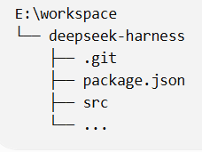
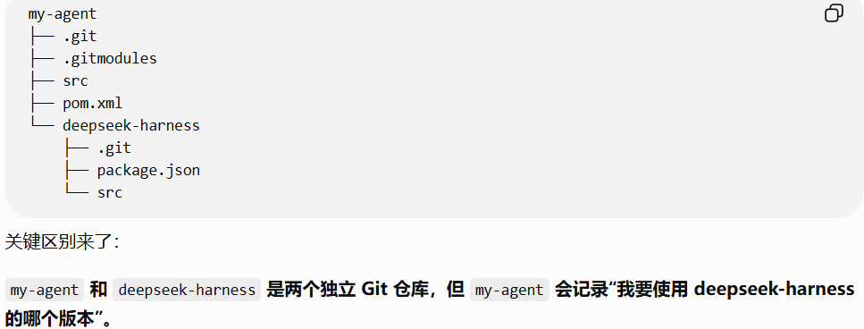
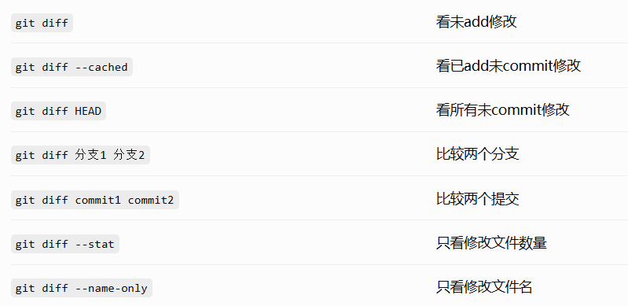

+++
title = 'Git 常用命令速查'
date = '2026-08-20T10:00:00+08:00'
draft = false
tags = ['Git']
+++

# Git 常用命令速查

> 本文整理了日常开发中最常用的 Git 命令，按操作场景分类，方便快速查阅与直接复制使用。

## 🔀 分支操作

- **查看当前分支**：`git branch`
- **查看文件修改状态**：`git status`
- **创建新分支并切换**：`git checkout -b dev_cyz`
- **切换分支**：`git checkout cyz`
- **查看所有远程分支**：`git branch -a`

## 📡 同步与远程

- **拉取远程最新代码**：`git fetch`
- **拉取并合并**：`git pull`
- **查看远程代码仓库**：`git remote -v`

## 📦 提交与推送

- **添加全部代码**：`git add .`
- **添加指定代码**：`git add src/test/java/UserServiceTest.java`
- **提交**：`git commit -m "add unit test"`
- **推送代码**：
  - 第一次：`git push -u origin dev_cyz`
  - 以后：`git push`

## 🕘 历史记录

- **查看提交记录**：
  - **简单**：`git log --oneline`
  - **详细**：`git log`

## ↩️ 撤销操作

- **撤销未提交修改**：
  - 文件：`git checkout -- 文件名`
  - 全部：`git checkout .`
- **撤销已提交**：
  - 不删除：`git reset --soft HEAD^`
  - 删除：`git reset --hard HEAD^`

> ⚠️ 注意：`git reset --hard` 会丢弃未提交的修改，执行前请确认。

## 🔎 其他操作

- **查看某次提交修改了什么**：`git show commitId //git show a82fd31`
- **把某个commit拿到当前分支**：`git cherry-pick commitId`

## 🧬 概念说明

- **git clone**：把一个 Git 仓库“复制下来”。

  

- **git submodule add**：把另一个 Git 仓库“作为当前项目的子项目”挂进来。

  

- **示意图**

  

## 📌 总结

日常开发中 Git 的核心流程是：`git add` 暂存修改 → `git commit` 提交快照 → `git push` 推送到远程；配合分支、拉取与回滚操作即可覆盖绝大多数场景。

| 场景 | 常用命令 |
| --- | --- |
| 查看分支 | `git branch` |
| 查看状态 | `git status` |
| 新建分支并切换 | `git checkout -b xxx` |
| 暂存修改 | `git add .` |
| 提交 | `git commit -m "..."` |
| 推送 | `git push` |
| 拉取合并 | `git pull` |
| 回滚 | `git reset --soft/hard HEAD^` |
