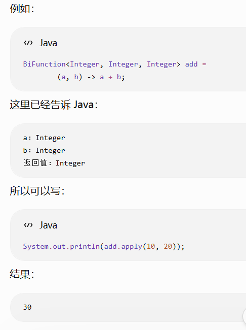
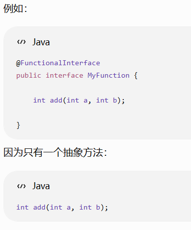
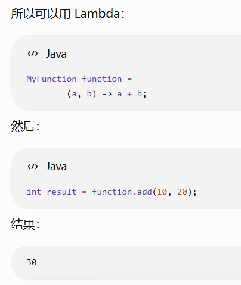
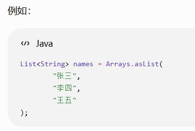
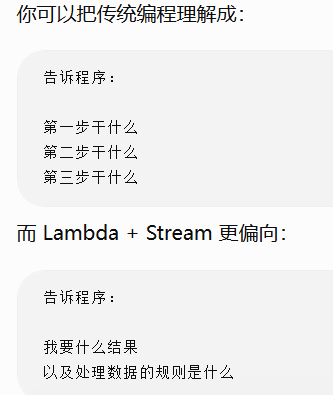

+++
title = 'Java 匿名内部类、Lambda 与 Stream 学习笔记'
date = '2026-08-20T11:10:00+08:00'
draft = false
tags = ['Java']
slug = 'java-lambda-stream'
+++

# Java 匿名内部类、Lambda 与 Stream 学习笔记

> 这篇笔记整理了 Java 中匿名内部类、Lambda 表达式、函数式接口与 Stream 流的核心概念和常用写法，包含语法示例与综合案例，适合 Java 初学者以及需要快速回顾的开发者。

## 📌 示例

**Lambda 必须依附于一个函数式接口。**

```java
Runnable runnable = new Runnable() {
@Override
public void run() {
System.out.println("Hello");
}
};
```



```java
Runnable runnable = () -> {
    System.out.println("Hello");
};
```

```java
Runnable runnable = () -> System.out.println("Hello");
```

Lambda 语法结构：

```
(参数) -> { 要执行的代码 }
参数        执行逻辑
↓             ↓
(a, b)  ->   a + b
```

```java
(a, b) -> {
return a + b;
}
```

```java
(a, b) -> a + b
```

## 🔬 函数式接口

**= 只有一个抽象方法的接口**





## 📦 Java自带的函数式接口：

- Consumer 有参数，没有返回值（消费数据）
- Function 有参数，有返回值（输入 → 输出）
- Predicate 有参数，返回boolean（判断）
- Supplier 没有参数，有返回值（提供数据）

## 🌊 Stream：



要求：找出长度大于2的名字

```java
//传统写法
List<String> result = new ArrayList<>();

for (String name : names) {
    if (name.length() > 2) {
        result.add(name);
    }
}
```

```java
//stream+lambda
List<String> result = names.stream()
        .filter(name -> name.length() > 2)
        .toList();
```

## 🔁 forEach

```java
names.forEach(name -> {
    System.out.println(name);
});
```

```java
names.forEach(name -> System.out.println(name));
```

```java
names.forEach(System.out::println);//方法引用
```

## 🔗 Lambda和匿名内部类的关系

```java
//匿名内部类
Runnable runnable = new Runnable() {
    @Override
    public void run() {
        System.out.println("Hello");
    }
};
```

```java
//lambda
Runnable runnable = ()->System.out.println("Hello");
```

lambda是匿名内部类的一种更加简洁的写法，但严格来说它不是所有匿名内部类的通用替代品，而是针对函数式接口。

## 💡 lambda思想



```java
for (User user : users) {
    if (user.getAge() >= 18) {
        System.out.println(user.getName());
    }
}
```

```java
users.stream()
        .filter(user -> user.getAge() >= 18)
        .map(user -> user.getName())
        .forEach(name -> System.out.println(name));
```

## ✍️ lambda语法

```java
//无参数
() -> System.out.println("Hello")
```

```java
//一个参数
name -> System.out.println(name)
(name) -> System.out.println(name)
```

```java
//多个参数
(a, b) -> a + b
```

```java
//多行
(name) -> {
    String result = name.toUpperCase();
    return result;
}
```

```java
(name) -> {
    return name.toUpperCase();
}
```

```java
//单行返回值
name -> name.length()
name -> {
    return name.length();
}
```

## 🏗️ stream流水线

- filter 过滤
- map 转换，一个盒子换一个盒子
- flatMap 拆平，把所有盒子打开放一起
- sorted 排序
- distinct 去重
- collect 收集结果，把Stream结果转换成各种集合。
- reduce聚合（求和，最大最小值，平均值，拼接）
- partitioningBy分区
- joining（字符串连接）

**//map flatMap**

```java
List<List<String>> classes = Arrays.asList(

    Arrays.asList("张三","李四"),

    Arrays.asList("王五","赵六")

);
```

```java
//想得到”张三“”李四“”王五“”赵六“
classes.stream()
.map(list -> list)
.toList();//[
```

```java
[张三,李四],
[王五,赵六]
]
```

```java
classes.stream()
.flatMap(list -> list.stream())
.toList();//[张三,李四,王五,赵六]
```

**//sorted**

```java
//升序
nums.stream()
.sorted()
.toList();
```

```java
//对象排序 按照年龄
users.stream()
.sorted(
(u1,u2)->u1.getAge()-u2.getAge()
)
.toList();
```

```java
users.stream()
.sorted(
Comparator.comparing(User::getAge)
)
.toList();
```

**//collect**

```java
//转list
toList() 相当于collect(Collectors.toList())
List<String> list =
users.stream()
.map(User::getName)
.collect(Collectors.toList());
```

```java
//转set(去重)
Set<String> set =
users.stream()
.map(User::getName)
.collect(Collectors.toSet());
```

```java
//分组
Map<Integer,List<User>> map =
users.stream()
.collect(
Collectors.groupingBy(
User::getAge
));
```

```java
//查询成年用户，获取姓名，去重，按照名字排序
List<String> result =
users.stream()

    //过滤成年人
    .filter(user -> user.getAge() >=18)

    //获取名字
    .map(User::getName)

    //去重
    .distinct()

    //排序
    .sorted()

    //收集
    .collect(Collectors.toList());
```

## 📌 总结

Lambda 是匿名内部类针对函数式接口的简化写法，配合四个内置函数式接口（Consumer、Function、Predicate、Supplier）和 Stream 流水线（filter、map、flatMap、sorted、distinct、collect 等），可以大幅简化集合操作代码。核心思路是把数据流看作一条流水线，每一步操作都是一道工序，最终用 collect 收集结果。

| 类别 | 要点 |
| --- | --- |
| Lambda 语法 | `() -> ...`、`x -> ...`、`(a, b) -> a + b`；多行用 `{}` + `return` |
| 函数式接口 | 只有一个抽象方法的接口；自带 Consumer、Function、Predicate、Supplier |
| Stream 常用操作 | filter 过滤、map/flatMap 转换、sorted 排序、distinct 去重、collect 收集 |
| 简化写法 | 方法引用 `System.out::println`、`Comparator.comparing(User::getAge)` |
